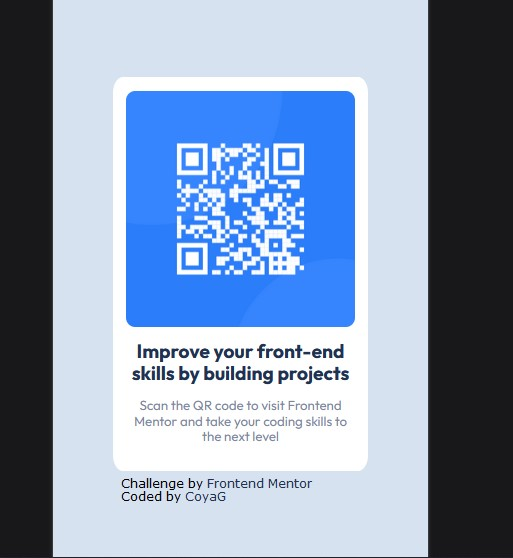

# Frontend Mentor - QR code component solution

This is a solution to the [QR code component challenge on Frontend Mentor](https://www.frontendmentor.io/challenges/qr-code-component-iux_sIO_H). Frontend Mentor challenges help you improve your coding skills by building realistic projects. 

## Table of contents

- [Overview](#overview)
  - [Screenshot](#screenshot)
  - [Links](#links)
- [My process](#my-process)
  - [Built with](#built-with)
  - [What I learned](#what-i-learned)
  - [Continued development](#continued-development)
- [Author](#author)

## Overview

### Screenshots

### Links

- [Solution](https://github.com/CoyaG/2-qr-code)
- [Live Site](https://your-live-site-url.com)

## My process

### Built with

- Semantic HTML5 markup
- CSS custom properties
- Flexbox

### What I learned

I learned that not everything needs to be responsive. This is a very simple site that can work across all platforms with a fixed width of the main container.

### Continued development

I would like to continue learning more about CSS. There are concepts I have yet to practice.

## Author

- Frontend Mentor - [@CoyaG](https://www.frontendmentor.io/profile/CoyaG)
- Twitter - [@CoyaG1](https://twitter.com/CoyaG1)